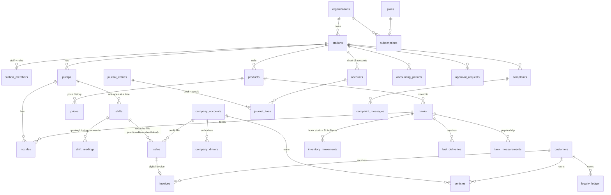
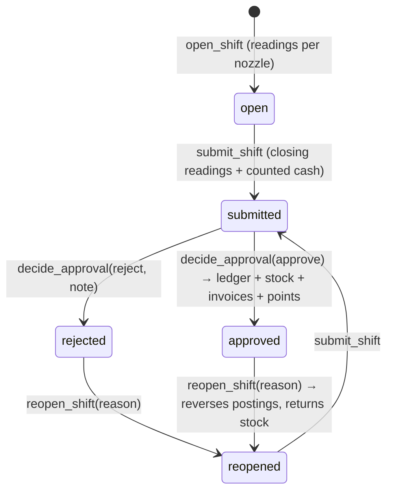

# FuelOS — data model (draft v0.1)

Source of truth: `supabase/migrations/*.sql`. This page is the map; the SQL is the territory.
Status: **draft, tested** — 5 migrations + seed + 88 automated checks pass on Postgres 16 (`supabase/tests`).

## 1. Tenancy

```
organizations 1─* stations 1─* station_members (user_id, role)
                           └── every station-owned row carries station_id
```

- A user can be a member of several stations with a different role in each (`owner`, `accountant`, `shift_manager`, `attendant`).
- Customers are separate (`customers.id = auth.users.id`) and are not station members.
- Platform staff (`platform_staff`) see station health and subscriptions only. They can read a station's finances only through a live `access_grants` row: a written reason, at most 24 hours, and audited.
- Composite foreign keys `(station_id, id)` stop a row pointing at another station's pump, tank or company.

## 2. Entity map



## 3. Shift lifecycle (the heart of the worker app)



**Cash formula (spec):**
`expected_cash = opening_cash + meter_sales − card − credit − voucher`
where `meter_sales = Σ (closing − opening) × price at shift open`. Cash fills are *not* recorded one by one: they come out of the meter.
Card, credit and voucher fills must be recorded (`record_sale`), and a fill linked to a customer is recorded so it gets an invoice.
If `|counted − expected| > stations.cash_tolerance` (default 1,000), a written reason is required.

## 4. Posting rules (automatic journal entries)

| Event (RPC) | Debit | Credit | Notes |
|---|---|---|---|
| Fuel delivery with cost (`record_fuel_delivery`) | 1200 Fuel inventory | 2000 Suppliers | If there is no cost, only the stock moves, and profit shows as *estimated* |
| Shift approved (`decide_approval`) | 1000 Cash (counted − opening), 1020 Card, 1100 Companies, 2100 Vouchers | 4000 Fuel sales (meter sales) | One balanced entry per shift |
| ↳ cash shortage | 5300 Cash shortage, or 1150 Employee receivable (option `shortage_to_employee`) | — | |
| ↳ cash surplus | — | 4200 Cash overage | |
| ↳ cost of fuel sold | 5000 COGS | 1200 Fuel inventory | Weighted average cost of priced deliveries; the description is tagged «(تكلفة غير مكتملة)» when a delivery has no cost |
| Stock count within tolerance / approved (`record_tank_measurement`) | 5400 Stock variance ↔ 1200 | | Direction depends on the sign |
| Expense (`post_expense`) | 5100 / 5200 / 5250 / 5260 / 5900 | 1000 Cash or 1010 Bank | |
| Company pays (`record_company_payment`) | 1000 / 1010 | 1100 Companies | |
| Reopen approved shift (`reopen_shift`) | reversal of every shift entry | | Reason required; stock is returned |

Chart of accounts: 21 system accounts, created by `create_station_defaults`. See `supabase/migrations/20260924000500_station_defaults.sql`.

## 5. Integrity rules enforced in the database

- A posted `journal_entries` row is immutable. Posting requires ≥ 2 lines and Σdebit = Σcredit > 0. The entry number is assigned on posting.
- A correction is a **reversal entry** with a reason, and an entry can be reversed at most once.
- A closed `accounting_periods` row cannot be reopened or posted into, and draft entries block the close.
- The following tables are append-only: `audit_log`, `inventory_movements`, `loyalty_ledger`, `invoice_corrections`, `company_payments`, `tank_measurements`, `complaint_messages`.
- `sales`: never deleted. Financial fields are frozen, so to change one you void it (with a reason) and record it again.
- `invoices` are never deleted; they move through pending → confirmed / corrected / cancelled.
- `shifts`: only the allowed transitions; one open shift per pump (`FUELOS_PUMP_BUSY`).
- Sensitive tables write to `audit_log` automatically: who, when, before, after and reason.

## 6. RPCs (what the apps call)

| RPC | Who | Idempotent |
|---|---|---|
| `create_station(org, name, currency, city, display_name)` | any signed-in user (becomes owner) | — |
| `open_shift(shift_id, pump, opening_cash, readings, device, client_created_at)` | attendant / manager / owner | ✅ client UUID |
| `record_sale(sale_id, shift, nozzle, liters, unit_price, method, …, request_approval)` | shift's attendant, manager, owner | ✅ client UUID |
| `lookup_company_for_sale(station, qr_or_plate)` | attendant+ | read |
| `shift_summary(shift)` | shift's attendant, staff | read |
| `submit_shift(shift, closing, counted_cash, diff_reason)` | shift's attendant, manager, owner | — |
| `decide_approval(request, approve, option, note)` | owner (stock: manager too) | — |
| `reopen_shift(shift, reason)` | owner | — |
| `publish_price(station, product, price, effective_at)` | owner | — |
| `record_fuel_delivery(...)`, `record_tank_measurement(tank, measured_l)` | manager / owner (+accountant for deliveries) | — |
| `post_expense(expense)`, `record_company_payment(...)`, `reverse_journal_entry(entry, reason)` | owner / accountant | — |
| `close_period(period)` / `open_next_period(station)` | owner / owner+accountant | — |

## 7. Error codes

Errors come back as `SQLSTATE P0001` (or `42501` for permissions), with a stable code in `message`.
The apps map each code to Arabic text (see `.claude/skills/fuelos-offline-sync`). The user never sees the raw code.

`FUELOS_PERMISSION_DENIED` · `FUELOS_NOT_FOUND` · `FUELOS_REQUIRED` · `FUELOS_REASON_REQUIRED` · `FUELOS_PUMP_BUSY` · `FUELOS_READING_MISSING` · `FUELOS_READING_BELOW_LAST` · `FUELOS_SHIFT_NOT_OPEN` · `FUELOS_SHIFT_INCOMPLETE` · `FUELOS_BAD_SHIFT_TRANSITION` · `FUELOS_PENDING_APPROVALS` · `FUELOS_NO_PRICE` · `FUELOS_CREDIT_LIMIT` (detail: `{remaining, possible_liters}`) · `FUELOS_COMPANY_FROZEN` · `FUELOS_COMPANY_SUSPENDED` · `FUELOS_DRIVER_NOT_AUTHORIZED` · `FUELOS_ID_CONFLICT` · `FUELOS_UNBALANCED_ENTRY` · `FUELOS_POSTED_IMMUTABLE` · `FUELOS_POST_VIA_UPDATE` · `FUELOS_PERIOD_CLOSED` · `FUELOS_DRAFTS_BLOCK_CLOSE` · `FUELOS_UNKNOWN_ACCOUNT` · `FUELOS_APPEND_ONLY` · `FUELOS_SALE_FROZEN` · `FUELOS_INVOICE_FROZEN` · `FUELOS_PIN_FORMAT` · `FUELOS_PIN_INVALID` (detail: `attempts_left`) · `FUELOS_PIN_LOCKED` (detail: `locked_until`) · `FUELOS_PIN_NOT_SET` · `FUELOS_DEVICE_NOT_REGISTERED` · `FUELOS_PIN_LOGIN_UNAVAILABLE`

## 8. Known simplifications (decide before production)

1. **One price per shift.** Sales use the price in force when the shift opened. A price change means closing the open shifts first; the owner UI should warn about this.
2. **COGS** uses a simple weighted average over all priced deliveries to a tank. A moving average or FIFO can come later.
3. **Currency** is `SYP` («ل.س») as a placeholder, with `money_decimals` per station.
4. **Loyalty**: 1 point per 250 on confirmed customer invoices. This is hard-coded and should move to `offers.rule` or station settings.
5. **Taxes** are not modeled yet.
6. **Postings in dates with no period row** are allowed. Periods only block closed ranges.
7. **Attendant PIN login** (L2): `issue_device_credential` gives a registered device a secret; the owner sets PINs with `set_member_pin` (bcrypt in `member_pins`, never audited in clear). The Edge Function `supabase/functions/attendant-pin-login` checks device + PIN through `verify_member_pin` (5 wrong PINs lock the member for 15 min) and mints a session. Attendant accounts need an email (a placeholder address is fine) because the session is minted through a server-side magic link.
